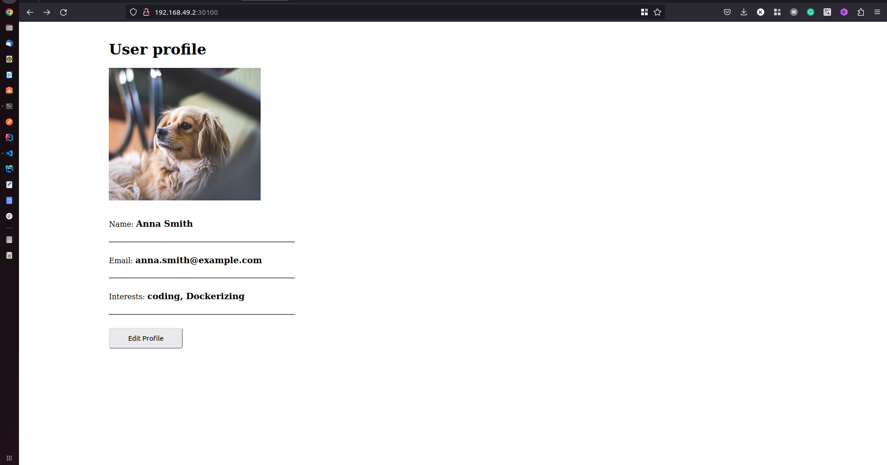

# Node App
  

***

## Kubernetes manifest file
    * mongo-config.yaml
    * mongo-secret.yaml
    * mongo.yaml
    * webapp.yaml
  
*** 
## Kubernetes & Minkube 
* Download Kubernetes (here)[https://kubernetes.io/docs/home/]
* Download Minikube (here)[https://minikube.sigs.k8s.io/docs/start/]
### Start Minikube
* minikube start 
* minikube start  --driver=docker 
### Check minikube status
* minikube status
### Inspect or Get Minikube ip address
* minikube ip 
* kubectl get node -o wide
### Stop Minikube cluster
* minikube stop 

*** 
### Steps to start application
1. kubectl apply -f mongo-config.yaml
2. kubectl apply -f mongo-secret.yaml
3. kubectl apply -f mongo.yaml
4. kubectl apply -f webapp.yaml

***
### Docker Image
* NodeApp: (docker repo)[https://hub.docker.com/repository/docker/nanajanashia/k8s-demo-app]

*** 
### Useful kubernetes cli commands
* kubectl get node
* kubectl get pod
* kubectl get svc
* kubectl get all
